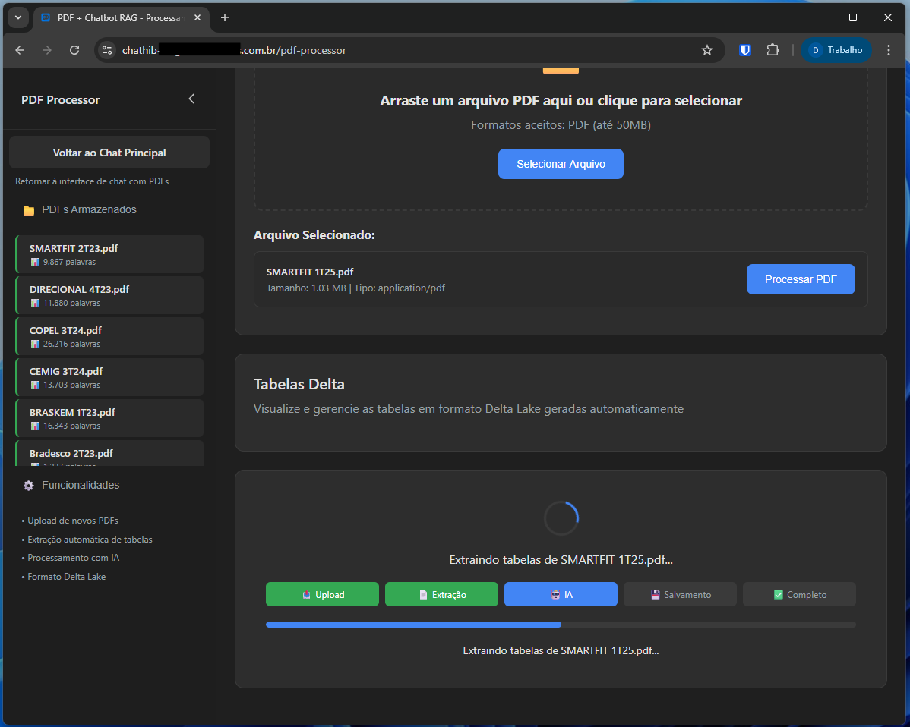

# ChatHib 

Uma Solução Dual de Inteligência Artificial para Extração Estruturada de Dados em Tabelas Delta e Geração de Respostas Conversacionais com RAG. 

## Visão Geral

O ChatHib é uma solução corporativa que permite interação natural com documentos PDF através de chat inteligente, utilizando modelos de linguagem avançados (AWS Bedrock Claude 3.5 Sonnet e Google Generative AI) para fornecer respostas contextuais baseadas no conteúdo dos documentos.

## Telas do chat

*Interface principal do ChatHib mostrando o chat interativo e upload de documentos*


*Pipeline do ChatHib mostrando o processamento do pdf*



*Pipeline do ChatHib mostrando o sucesso do processamento*


## Arquitetura do Sistema

### Componentes Principais

**Backend (FastAPI)**
- Processamento de PDFs e extração de texto
- Integração com AWS Bedrock e Google AI
- Geração de embeddings e chunks de documentos
- APIs RESTful para todas as operações
- Armazenamento em AWS DynamoDB e S3

**ChromaDB Service (FastAPI)**
- Vector database dedicado para embeddings
- Queries de similaridade semântica
- Persistência de dados com fallback em memória
- APIs especializadas para operações RAG

**Frontend (FastAPI + Jinja2)**
- Interface web responsiva
- Chat interativo com sistema de feedback
- Autenticação Azure AD OAuth 2.0
- Upload de arquivos com progress tracking
- Processamento avançado de documentos

**Infraestrutura (Kubernetes)**
- Deploy automatizado no AWS EKS
- Escalabilidade horizontal
- Monitoramento e logs centralizados
- Configuração via ConfigMaps e Secrets

### Tecnologias Utilizadas

**Inteligência Artificial**
- AWS Bedrock (Claude 3.5 Sonnet)
- Google Generative AI (Gemini)
- LangChain para orquestração de LLMs
- SentenceTransformers para embeddings

**Armazenamento**
- AWS DynamoDB (dados estruturados)
- AWS S3 (arquivos e tabelas Delta)
- ChromaDB (vector database)
- Delta Lake (dados analíticos)

**Desenvolvimento**
- Python 3.11
- FastAPI para APIs
- Docker para containerização
- Kubernetes para orquestração

## Estrutura do Projeto

```
chathib/
├── backend/                 # Serviço principal de processamento
│   ├── main.py             # Aplicação FastAPI principal
│   ├── services/           # Serviços de negócio
│   ├── api/                # Modelos e rotas da API
│   ├── requirements.txt    # Dependências Python
│   └── Dockerfile         # Container Docker
├── chromadb_service/       # Serviço de vector database
│   ├── main.py            # API ChromaDB dedicada
│   ├── requirements.txt   # Dependências específicas
│   ├── Dockerfile         # Container ChromaDB
│   └── Dockerfile.prod    # Build otimizado
├── frontend/               # Interface web
│   ├── interface/
│   │   ├── app/           # Aplicação principal
│   │   └── auth/          # Módulos de autenticação
│   ├── requirements.txt   # Dependências web
│   ├── Dockerfile         # Container frontend
│   └── Dockerfile.prod    # Build otimizado
└── infra/                  # Infraestrutura Kubernetes
    └── k8s/               # Manifestos Kubernetes
        ├── backend/       # Deploy do backend
        ├── chromadb/      # Deploy do ChromaDB
        └── frontend/      # Deploy do frontend
```

## Funcionalidades

### Chat Inteligente com RAG
- Conversas naturais sobre conteúdo de PDFs
- Respostas contextuais baseadas em similaridade semântica
- Histórico de conversas persistente
- Sistema de feedback para melhoria contínua

### Processamento Avançado de PDFs
- Extração automática de texto e tabelas
- Geração de chunks otimizados para RAG
- Criação de embeddings com SentenceTransformers
- Armazenamento estruturado em vector database

### Análise de Documentos
- Identificação automática de tabelas e dados estruturados
- Geração de datasets Delta Lake
- Export em múltiplos formatos (CSV, Parquet)
- Processamento assíncrono para arquivos grandes

### Interface Corporativa
- Autenticação integrada com Azure AD
- Design responsivo inspirado no Google Gemini
- Upload drag-and-drop com progress visual
- Sidebar com histórico de conversas

### Monitoramento e Observabilidade
- Health checks em todos os serviços
- Logs estruturados para debugging
- Métricas de performance e uso
- Status de processamento em tempo real

## Configuração e Deploy

### Pré-requisitos

**Infraestrutura AWS**
- Conta AWS com permissões para DynamoDB, S3 e Bedrock
- EKS cluster configurado (opcional para Kubernetes)
- Credenciais AWS configuradas

**Autenticação Azure**
- Aplicação registrada no Azure AD
- Client ID, Secret e Tenant ID configurados
- Redirect URI para OAuth configurado

**Dependências Locais**
- Docker e Docker Compose
- Python 3.11+ (para desenvolvimento local)
- kubectl (para deploy Kubernetes)

### Variáveis de Ambiente

**Backend**
```bash
# AWS Bedrock
USE_BEDROCK=true
AWS_DEFAULT_REGION=us-east-1
AWS_ACCESS_KEY_ID=sua_access_key
AWS_SECRET_ACCESS_KEY=sua_secret_key

# Google AI (fallback)
GOOGLE_API_KEY=sua_chave_google

# DynamoDB
AWS_REGION=ca-central-1
DYNAMODB_TABLE_CHAT_HISTORY=chathib-chat-history
DYNAMODB_TABLE_PDFS=chathib-pdfs
DYNAMODB_TABLE_USERS=chathib-users
DYNAMODB_TABLE_COLLECTIONS=chathib-collections

# ChromaDB
CHROMADB_SERVICE_URL=http://chromadb-service:8001
```

**Frontend**
```bash
# Azure AD
AZURE_CLIENT_ID=sua_azure_client_id
AZURE_CLIENT_SECRET=sua_azure_client_secret
AZURE_TENANT_ID=sua_azure_tenant_id
AZURE_REDIRECT_URI=http://localhost:8080/auth/azure/callback

# Backend
BACKEND_SERVICE_URL=http://backend-service:8000
```

### Deploy Local com Docker

**1. Build dos serviços**
```bash
# Backend
cd backend
docker build -t chathib-backend .

# ChromaDB Service
cd chromadb_service
docker build -t chathib-chromadb .

# Frontend
cd frontend
docker build -t chathib-frontend .
```

**2. Executar serviços**
```bash
# ChromaDB (primeiro)
docker run -d -p 8001:8001 \
  -v $(pwd)/chroma_data:/app/chroma_data \
  --name chromadb-service \
  chathib-chromadb

# Backend
docker run -d -p 8000:8000 \
  --link chromadb-service \
  -e CHROMADB_SERVICE_URL=http://chromadb-service:8001 \
  -e AWS_ACCESS_KEY_ID=sua_key \
  -e AWS_SECRET_ACCESS_KEY=sua_secret \
  --name backend-service \
  chathib-backend

# Frontend
docker run -d -p 8080:8080 \
  --link backend-service \
  -e BACKEND_SERVICE_URL=http://backend-service:8000 \
  -e AZURE_CLIENT_ID=sua_azure_id \
  --name frontend-service \
  chathib-frontend
```

**3. Acessar aplicação**
```
http://localhost:8080
```

### Deploy Kubernetes (AWS EKS)

**1. Configurar contexto kubectl**
```bash
aws eks update-kubeconfig --region us-east-1 --name seu-cluster
```

**2. Deploy dos serviços**
```bash
# ChromaDB
cd infra/k8s/chromadb
kubectl apply -f .

# Backend
cd ../backend
kubectl apply -f .

# Frontend
cd ../frontend
kubectl apply -f .
```

**3. Verificar deploy**
```bash
kubectl get pods -n chathib
kubectl get services -n chathib
```

## Uso

### 1. Upload de Documentos
- Acesse a interface web
- Faça login com credenciais Azure AD
- Use o upload drag-and-drop para enviar PDFs
- Aguarde o processamento automático

### 2. Chat com Documentos
- Digite perguntas sobre o conteúdo dos PDFs
- Receba respostas contextuais baseadas em IA
- Use o sistema de feedback (like/dislike) para melhorar respostas
- Acesse histórico de conversas na sidebar

### 3. Processamento Avançado
- Acesse "Processamento Avançado" na sidebar
- Extraia tabelas estruturadas dos PDFs
- Gere datasets Delta Lake para análise
- Export dados em formato CSV/Parquet

### 4. Monitoramento
- Verifique status dos serviços via health checks
- Monitore uploads em tempo real
- Acesse logs para debugging
- Acompanhe métricas de uso

## APIs

### Backend (Porta 8000)

**Chat e RAG**
- `POST /chat` - Chat com RAG
- `POST /query` - Consultas específicas
- `GET /chat-history` - Histórico de conversas

**Upload e PDFs**
- `POST /upload-pdf` - Upload de PDF
- `GET /pdfs` - Listar PDFs processados
- `DELETE /pdfs/{name}` - Deletar PDF
- `GET /upload-status/{task_id}` - Status de upload

**Usuários e Stats**
- `POST /users` - Criar usuário
- `GET /users/{id}` - Obter usuário
- `GET /stats` - Estatísticas gerais

**Health Checks**
- `GET /health` - Status básico
- `GET /health/detailed` - Status detalhado
- `GET /health/processing` - Status de processamento

### ChromaDB Service (Porta 8001)

**Coleções**
- `GET /collections` - Listar coleções
- `POST /collections/{name}/add` - Adicionar documentos
- `POST /collections/{name}/query` - Consultar similaridade
- `DELETE /collections/{name}` - Deletar coleção

**Administração**
- `GET /health` - Status do ChromaDB
- `GET /stats` - Estatísticas do vector database

### Frontend (Porta 8080)

**Interface**
- `GET /` - Página principal
- `GET /login` - Página de login
- `GET /pdf-processor` - Processamento avançado

**Autenticação**
- `GET /auth/azure` - Login Azure AD
- `GET /auth/azure/callback` - Callback OAuth
- `GET /logout` - Logout

**Upload e Chat**
- `POST /upload-pdf-s3` - Upload de PDF
- `POST /chat-pdf` - Enviar mensagem
- `POST /feedback` - Feedback sobre respostas

## Desenvolvimento

### Setup Local

**1. Clone o repositório**
```bash
git clone https://github.com/fsodanilo/chathib.git
cd chathib
```

**2. Configure ambiente Python**
```bash
python -m venv venv
source venv/bin/activate  # Linux/Mac
# ou
venv\Scripts\activate     # Windows
```

**3. Instale dependências (cada serviço)**
```bash
cd backend && pip install -r requirements.txt
cd ../chromadb_service && pip install -r requirements.txt
cd ../frontend && pip install -r requirements.txt
```

**4. Configure variáveis de ambiente**
```bash
cp .env.example .env
# Edite .env com suas configurações
```

**5. Execute serviços localmente**
```bash
# Terminal 1 - ChromaDB
cd chromadb_service
uvicorn main:app --host 0.0.0.0 --port 8001 --reload

# Terminal 2 - Backend
cd backend
uvicorn main:app --host 0.0.0.0 --port 8000 --reload

# Terminal 3 - Frontend
cd frontend/interface/app
uvicorn main:app --host 0.0.0.0 --port 8080 --reload
```

### Contribuição

**1. Fork o projeto**
**2. Crie uma branch para sua feature**
```bash
git checkout -b feature/nova-funcionalidade
```

**3. Commit suas mudanças**
```bash
git commit -am 'Adiciona nova funcionalidade'
```

**4. Push para a branch**
```bash
git push origin feature/nova-funcionalidade
```

**5. Abra um Pull Request**

## Troubleshooting

### Problemas Comuns

**Erro de conexão com AWS**
- Verifique credenciais AWS
- Confirme permissões para DynamoDB, S3 e Bedrock
- Teste conectividade: `aws sts get-caller-identity`

**ChromaDB não responde**
- Verifique se o serviço está rodando na porta 8001
- Teste health check: `curl http://localhost:8001/health`
- Verifique logs do container: `docker logs chromadb-service`

**Erro de autenticação Azure AD**
- Confirme Client ID, Secret e Tenant ID
- Verifique Redirect URI no Azure AD
- Teste fluxo OAuth manualmente

**Upload de PDF falha**
- Verifique tamanho do arquivo (limite configurado)
- Confirme conectividade com S3
- Verifique logs de processamento

**Chat não funciona**
- Verifique se PDFs foram processados com sucesso
- Teste conectividade Backend ↔ ChromaDB
- Confirme configuração dos modelos de IA

### Logs e Monitoramento

**Docker Logs**
```bash
docker logs backend-service -f
docker logs chromadb-service -f
docker logs frontend-service -f
```

**Kubernetes Logs**
```bash
kubectl logs -n chathib deployment/backend-deployment -f
kubectl logs -n chathib deployment/chromadb-deployment -f
kubectl logs -n chathib deployment/frontend-deployment -f
```

**Health Checks**
```bash
curl http://localhost:8000/health      # Backend
curl http://localhost:8001/health      # ChromaDB
curl http://localhost:8080/health      # Frontend
```

## Segurança

### Autenticação e Autorização
- Azure AD OAuth 2.0 para autenticação corporativa
- Tokens JWT para sessões seguras
- Validação de tokens em todas as rotas protegidas
- Logout completo com limpeza de sessão

### Proteção de Dados
- Comunicação HTTPS em produção
- Dados sensíveis via Kubernetes Secrets
- Validação e sanitização de inputs
- Logs sem informações sensíveis

### Infraestrutura
- Containers executam como usuário não-root
- Network policies restritivas no Kubernetes
- Secrets gerenciados pelo AWS Secrets Manager
- Backup automático de dados críticos

## Performance

### Otimizações Implementadas
- Processamento assíncrono de PDFs grandes
- Caching de embeddings gerados
- Pool de conexões para databases
- Lazy loading de modelos de IA
- Compressão de responses HTTP

### Métricas de Performance
- Tempo de processamento de PDF: < 30s para documentos típicos
- Latência de chat: < 3s para respostas
- Throughput: 100+ requests/minuto por instância
- Disponibilidade: 99.9% uptime target

### Escalabilidade
- Horizontal scaling via Kubernetes HPA
- Sharding de dados por usuário/tenant
- Load balancing automático
- Cache distribuído para sessões

## Licença

Este projeto é propriedade do Danio Oliveira

## Desenvolvimento: 
**Danilo Oliveira - TCC Pós-graduação NLP da Universidade Federal de Goiás**
## Documentação: 
**Consulte os READMEs específicos de cada serviço**


### Versão Atual (0.1.4)
- Chat RAG funcional com AWS Bedrock
- Interface web completa
- Deploy Kubernetes automatizado
- Autenticação Azure AD

